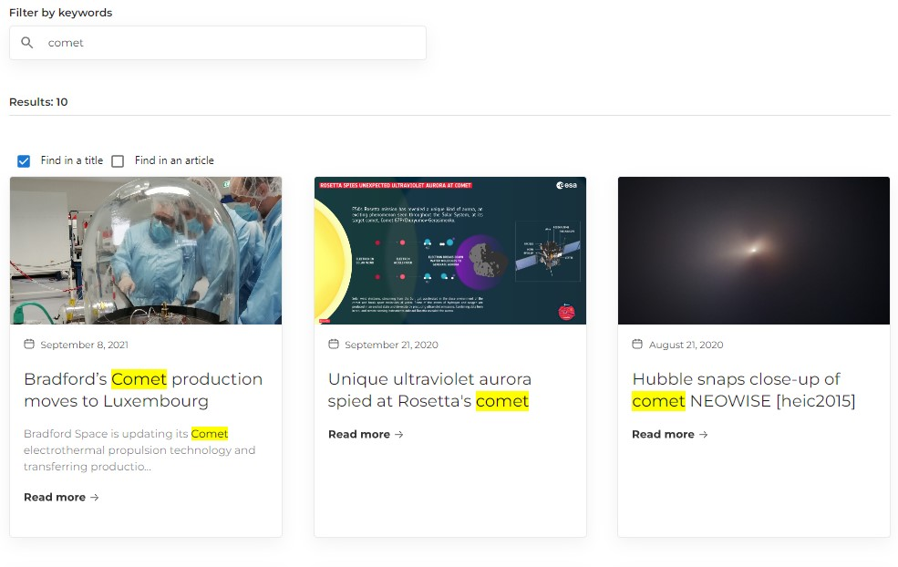
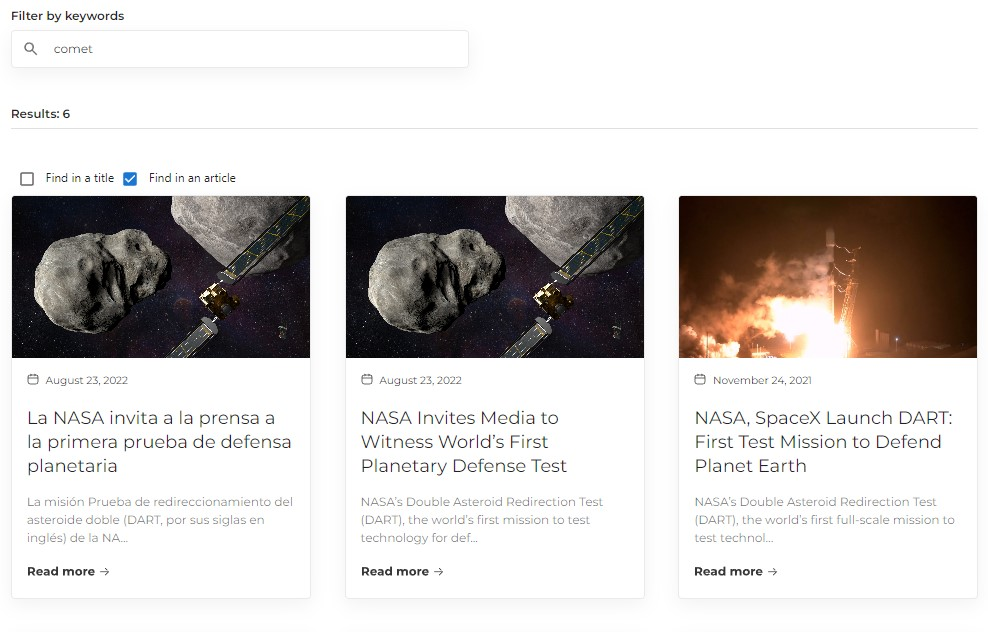
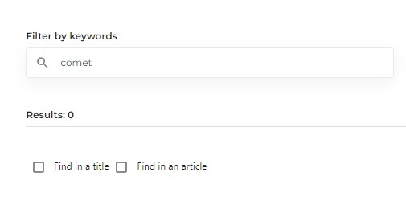
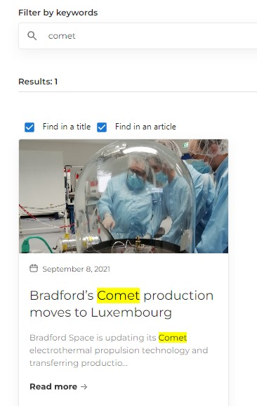
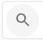
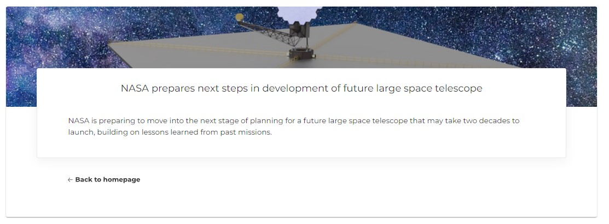

<br/>
<p align="center">
  

  <h3 align="center">Articles</h3>

  <p align="center">
    Single page application named Articles
    <br/>
    <br/>
    <a href="#">View Demo</a>
  </p>
</p>

## Table Of Contents

* [About the Project](#about-the-project)
* [Built With](#built-with)
* [Getting Started](#getting-started)
  * [Installation App](#installation-app)
* [Author](#author)

## About The Project

By default the application has an opportunity find articles by keywords in titles of articles.



User can choose finding mode by checkbox 'Find in a title', 'Find in an articles' and both modes together.





Found items are highlighted yellow color.



After typing keywords user should press left button

or press "Enter" after typing. Then cards will displayed on HomePage. There are cards with article titles and descriptions for 100 characters. The user can click on the card to go to an article page that contains the title and full description of the selected article.



The aplication is adapted to all devices.

## Built With
The application was implemented by using:

<h5 align="left">Languages, Frameworks and Tools:</h5>
<p align="left">
<a href="https://www.gnu.org/software/bash/" target="_blank" rel="noreferrer"> 
 </a> 
<a href="https://www.w3schools.com/css/" target="_blank" rel="noreferrer">  </a> 
</a> 
<a href="https://git-scm.com/" target="_blank" rel="noreferrer">  
</a>
<a href="https://www.w3.org/html/" target="_blank" rel="noreferrer">  
</a> 
<a href="https://developer.mozilla.org/en-US/docs/Web/JavaScript" target="_blank" rel="noreferrer">  
</a> 
<a href="https://nodejs.org" target="_blank" rel="noreferrer">  
</a>
<a href="https://postman.com" target="_blank" rel="noreferrer">  
</a> 
<a href="https://reactjs.org/" target="_blank" rel="noreferrer">  </a> <a href="https://redux.js.org" target="_blank" rel="noreferrer">  
</a> 
<a href="https://sass-lang.com" target="_blank" rel="noreferrer">  </a> <a href="https://www.typescriptlang.org/" target="_blank" rel="noreferrer">  
</a> 
<a href="https://webpack.js.org" target="_blank" rel="noreferrer">  
</a> 
</p>

## Getting Started

To get a local copy up and running follow these simple example steps.

### Installation App

1. Clone the repo

```sh
git clone https://github.com/vlasiuk-anatolii/articles
```

2. Install NPM packages

```sh
npm install
```

3. Type in the terminal

```sh
npm start
```
## Author

* **Vlasiuk Anatolii** - [Vlasiuk Anatolii](https://github.com/vlasiuk-anatolii) - *Built SPA: Articles*
